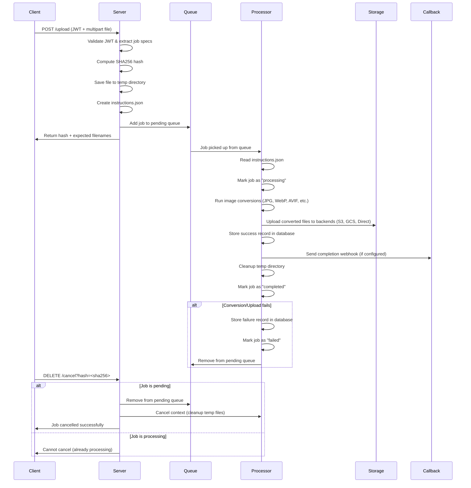

# 🌌 Pixerve

**Pixerve** is a work-in-progress, open-source image ingestion and processing server built for modern web services.
It aims to make image handling **predictable, transparent, and fast** — without locking anyone into closed APIs or external services.

**Scope**: Pixerve focuses exclusively on **upload → convert → storage**. It is designed as a single-user service. For multi-user scenarios, integrate with a dedicated JWT generator and user management application.

---

## 🧭 Motivation

Every growing product ends up building the same thing over and over again:
a simple, reliable place to upload images, convert them, resize them, and serve them.

Pixerve is our attempt to stop rewriting that wheel — and do it properly this time:
a small, efficient image worker you can host, shape, and extend however you like.

---

## 🌟 Current Features

### ✅ Core Functionality

- **JWT-Based Authentication**: Secure upload authorization with structured job specifications
- **Multi-Format Conversion**: Support for JPG, PNG, WebP, AVIF, and lossless copying
- **Multiple Storage Backends**: S3, Google Cloud Storage, SFTP, and direct HTTP serving
- **Success Tracking**: Persistent success storage with query API and file counts
- **HTTP Callbacks**: Completion webhooks with custom headers and payload
- **Job Cancellation**: Cancel pending jobs by hash with automatic cleanup
- **Automatic Cleanup**: Time-based cleanup of old success/failure records (30+ days)

### ✅ API Endpoints

- `POST /upload` - Upload images with JWT authentication
- `GET /health` - Health check endpoint for load balancers and monitoring
- `GET /version` - Version information and build details
- `GET /status?hash=<sha256>` - Check job processing status
- `DELETE /cancel?hash=<sha256>` - Cancel a pending job by hash
- `GET /failures?hash=<sha256>` - Check processing status for failed files
- `GET /failures/list` - Admin endpoint for listing all failures
- `GET /success?hash=<sha256>` - Check processing status for successful files
- `GET /success/list` - Admin endpoint for listing all successes
- `GET /files/*` - Serve processed images directly (when `directHost: true` in JWT)

### ✅ Job States

Jobs progress through the following states:

- **pending** - Job uploaded and queued for processing
- **processing** - Job is currently being converted and uploaded
- **completed** - Job finished successfully
- **failed** - Job encountered an error during processing
- **cancelled** - Job was cancelled before completion

Only **pending** jobs can be cancelled. Once a job starts processing, it cannot be cancelled.

---

## 🔄 Upload & Processing Pipeline

Here's how Pixerve processes image uploads from start to finish:

### ASCII Diagram (Universal)

```text
┌─────────────┐    ┌─────────────┐    ┌─────────────┐    ┌─────────────┐
│   Client    │    │   Server    │    │    Queue    │    │  Processor  │
│             │    │             │    │             │    │             │
│ POST /upload│───▶│ 1. Validate │───▶│ 5. Enqueue  │───▶│ 6. Process  │
│ (JWT + file) │    │    JWT      │    │    Job      │    │    Job      │
│             │    │             │    │             │    │             │
│ 2. Get hash │◀───│ 3. Save to  │    │             │    │ 7. Convert  │
│ + filenames  │    │    temp     │    │             │    │    images   │
│             │    │             │    │             │    │             │
│             │    │ 4. Create   │    │             │    │ 8. Upload to│
│             │    │ instructions│    │             │    │   storage   │
└─────────────┘    └─────────────┘    └─────────────┘    └─────────────┘
                                                          │             │
                                                          │ 9. Store    │
                                                          │   success   │
                                                          │             │
                                                          │ 10. Send    │
                                                          │   callback  │
                                                          │             │
                                                          │ 11. Cleanup │
                                                          └─────────────┘
```

### Interactive Mermaid Diagram

**Note:** Requires Mermaid.js support in your markdown viewer. If not supported, use the ASCII diagram above.



### Pipeline Steps Explained

1. **Upload & Validation**
   - Client sends JWT token + image file via multipart form
   - Server validates JWT and extracts job specifications
   - File is hashed (SHA256) and saved to temporary directory
   - Job instructions are written to `instructions.json`
   - Job is added to pending queue, response sent immediately

2. **Queue Processing**
   - Background processor continuously monitors pending queue
   - Jobs are processed one at a time (no concurrency limits)
   - Failed jobs are removed from queue to prevent infinite retries

3. **Image Processing**
   - Instructions loaded from `instructions.json`
   - Multiple conversions run based on JWT specifications
   - Output files saved to `output/` subdirectory

4. **Storage & Distribution**
   - Converted files uploaded to configured storage backends
   - S3, Google Cloud Storage, SFTP, or direct HTTP serving
   - Files organized by JWT-specified subdirectories

5. **Completion & Cleanup**
   - Success/failure records stored in persistent database
   - HTTP callbacks sent with custom headers (if configured)
   - Temporary directories cleaned up automatically

6. **Monitoring & Control**
   - Job status can be queried via `GET /status?hash=<sha256>`
   - Pending jobs can be cancelled via `DELETE /cancel?hash=<sha256>`
   - Success/failure records available via query endpoints

### Data Flow

```text
JWT Token → Job Specs → Temp Storage → Queue → Processing → Storage Backends
       ↓           ↓           ↓         ↓         ↓            ↓
   Authenticate  Parse      Save File  Enqueue  Convert     Upload
   & Authorize  Formats    + Hash     Job      Images      Files
```

---

### ✅ Job Specification (JWT Payload)

```json
{
  "iss": "your-app",
  "sub": "user-123",
  "iat": 1640995200,
  "exp": 1641081600,
  "job": {
    "completionCallback": "https://your-app.com/webhook",
    "callbackHeaders": {"Authorization": "Bearer token"},
    "priority": 0,
    "keepOriginal": false,
    "formats": {
      "jpg": {
        "settings": {"quality": 80, "speed": 1},
        "sizes": [[800, 600], [400, 300]]
      },
      "webp": {
        "settings": {"quality": 85, "speed": 2},
        "sizes": [[800], [400]]
      }
    },
    "storageKeys": {
      "s3": "s3-credential-key",
      "gcs": "gcs-credential-key"
    },
    "directHost": true,
    "subDir": "tenant-123"
  }
}
```

---

## 🚀 Quick Start

### Prerequisites

- Go 1.21+
- ImageMagick (`magick` command) for JPG/PNG conversion
- `cwebp` for WebP conversion  
- `avifenc` for AVIF conversion

### Installation

```bash
git clone https://github.com/yourusername/pixerve.git
cd pixerve
go mod download
```

### Configuration

#### JWT Secret

Set the JWT secret in `config/jwt_secret.go`:

```go
package config

const SHARED_JWT_SECRET = "your-256-bit-secret"
```

#### Data Directory

Pixerve stores its databases (credentials and failure tracking) in a configurable data directory. By default, it uses `./data` relative to the executable.

**Environment Variable:**

```bash
export PIXERVE_DATA_DIR="/path/to/your/data/directory"
```

**Default Behavior:**

- Credentials database: `./data/credentials.db`
- Failures database: `./data/failures.db`

The data directory and its subdirectories will be created automatically on first run.

#### Direct File Serving Directory

When using `directHost: true` in JWT specifications, processed images are served directly by Pixerve's HTTP server. Configure the base directory where files are stored.

**Environment Variable:**

```bash
export PIXERVE_SERVE_DIR="/path/to/serve/directory"
```

**Default Behavior:**

- Direct serve directory: `./serve` relative to the executable
- Files accessible at: `http://localhost:8080/files/{subDir}/{filename}`

The serve directory and its subdirectories will be created automatically during processing.

### Running

```bash
go run main.go
```

Server starts on `http://localhost:8080`

### Health Check

Test that the server is running:

```bash
curl http://localhost:8080/health
# {"status":"healthy","timestamp":"2025-10-15T...","version":"1.0.0"}
```

---

## 📖 Usage Guide

### 1. Upload Images

**Endpoint**: `POST /upload`

**Headers**:

``` text
Authorization: Bearer <jwt-token>
Content-Type: multipart/form-data
```

**Body**:

``` text
file: <image-file>
```

**Response** (immediate):

```json
{
  "hash": "sha256_of_uploaded_file",
  "expected_files": [
    "hash_original_600_800_.jpg",
    "hash_original_300_400_.jpg", 
    "hash_original_600_800_.webp",
    "hash_original.jpg"
  ]
}
```

### 2. Check Processing Status

#### Check for Failures

**Endpoint**: `GET /failures?hash=<sha256>`

**Response** (success - no failure found):

```json
{
  "hash": "sha256...",
  "status": "success",
  "message": "File processed successfully"
}
```

**Response** (failure):

```json
{
  "hash": "sha256...",
  "status": "failed",
  "timestamp": "2025-10-15T18:20:56Z",
  "error": "processing failed: invalid image format",
  "job_data": "{...}"
}
```

#### Check for Success Details

**Endpoint**: `GET /success?hash=<sha256>`

**Response** (success found):

```json
{
  "hash": "sha256...",
  "status": "success",
  "timestamp": "2025-10-15T18:20:56Z",
  "file_count": 3,
  "job_data": "{...}"
}
```

**Response** (not found):

```json
{
  "hash": "sha256...",
  "status": "not_found",
  "message": "No success record found for this hash"
}
```

### 3. Access Processed Files

When `directHost: true` is specified in the JWT, processed images are served directly by Pixerve.

**Access URLs**: `GET /files/{subDir}/{filename}`

Example URLs for the upload response above:

- `http://localhost:8080/files/tenant-123/hash_original_600_800_.jpg`
- `http://localhost:8080/files/tenant-123/hash_original_300_400_.jpg`
- `http://localhost:8080/files/tenant-123/hash_original_600_800_.webp`
- `http://localhost:8080/files/tenant-123/hash_original.jpg`

**Note**: The `subDir` comes from the `subDir` field in your JWT job specification.

### 4. Completion Callbacks

Pixerve supports HTTP callbacks when job processing completes successfully. Include `completionCallback` and optional `callbackHeaders` in your JWT job specification.

**Callback Payload**:

```json
{
  "hash": "sha256_of_processed_file",
  "status": "completed",
  "file_count": 3,
  "timestamp": 1640995200,
  "job_data": { ... }
}
```

**Callback Headers**: Custom headers can be specified in `callbackHeaders` for authentication.

### 4. JWT Token Creation

Create JWT tokens with job specifications using your preferred JWT library:

```javascript
const jwt = require('jsonwebtoken');

const payload = {
  iss: 'my-app',
  sub: 'user-123',
  iat: Math.floor(Date.now() / 1000),
  exp: Math.floor(Date.now() / 1000) + 3600, // 1 hour
  job: {
    completionCallback: 'https://my-app.com/webhook',
    formats: {
      jpg: {
        settings: { quality: 80 },
        sizes: [[800, 600], [400, 300]]
      }
    },
    storageKeys: { s3: 'my-s3-key' },
    directHost: true
  }
};

const token = jwt.sign(payload, 'your-secret-key');
```

### 4. Storage Backend Setup

#### S3 Configuration

Store credentials in Pebble DB:

```bash
# Add S3 credentials
curl -X POST http://localhost:8080/admin/credentials \
  -d '{"key": "my-s3-key", "type": "s3", "data": {"access_key": "...", "secret_key": "...", "bucket": "..."}}'
```

#### Direct Serving

Files served at: `http://your-server/files/tenant-123/filename.jpg`

---

## 🧪 Testing

### Unit Tests

Run the Go unit test suite:

```bash
go test ./tests/...
```

Test coverage includes:

- JWT token parsing and validation
- Job processing logic
- Failure store operations
- Success store operations
- Encoder registration
- Pending job management
- Configuration handling
- HTTP API endpoints

### Integration Tests

Run comprehensive integration tests that test the full API workflow:

```bash
cd integration-tests
npm install
npm test
```

The TypeScript integration tests:

- Automatically build and start Pixerve
- Test real HTTP API endpoints
- Demonstrate usage patterns for TS/JS applications
- Validate JWT creation and file uploads
- Test success/failure status checking
- Verify callback functionality

**Note**: Integration tests require Go and Node.js to be installed.

---

## 🏗️ Architecture

``` text
┌─────────────────┐    ┌──────────────────┐    ┌─────────────────┐
│   HTTP Server   │────│  Job Processing  │────│  Storage        │
│                 │    │  - JWT Parsing   │    │  Backends       │
│ • /upload       │    │  - Conversions   │    │  - S3           │
│ • /failures     │    │  - Callbacks     │    │  - GCS          │
│ • /success      │    │  - File Naming   │    │  - SFTP         │
└─────────────────┘    └──────────────────┘    │  - Direct       │
                                               └────────|────────┘
┌─────────────────┐    ┌──────────────────┐    ┌────────|────────┐
│  Queue System   │────│  Success Store   │────│  Failure Store  │
│                 │    │  - Pebble DB     │    │  - Pebble DB    │
│ • File-based    │    │  - Query API     │    │  - Query API    │
│ • In-memory     │    │  - Cleanup       │    │  - Cleanup      │
└─────────────────┘    └──────────────────┘    └─────────────────┘
```

**Data Directory Structure**:

``` text
./data/
├── credentials.db    # Storage credentials
├── failures.db       # Processing failures
└── success.db        # Processing successes
```

**Automatic Cleanup**: Old records (>30 days) are automatically cleaned up every 24 hours.

---

## 📋 What Remains To Do

### 🔄 High Priority

- **Credential Management API**: REST endpoints for managing storage credentials
- **Rate Limiting**: Prevent abuse and manage resource usage
- **Metrics & Monitoring**: Processing stats, queue depth, failure rates

### 🔄 Medium Priority  

- **Batch Uploads**: Support multiple files in single request
- **Progress Tracking**: Real-time processing status updates
- **Image Optimization**: Auto-orientation, EXIF stripping, format selection

### 🔄 Low Priority

- **Video Support**: Extend to video transcoding
- **Webhook Retries**: Failed callback retry logic
- **Admin Dashboard**: Web UI for monitoring and management
- **Plugin System**: Custom encoders and storage backends

---

## 🚀 Enhancement Suggestions

### Performance

- **Worker Pool**: Multiple concurrent workers for high throughput
- **Caching Layer**: Redis for frequently accessed images

### Reliability

- **Dead Letter Queue**: Handle persistently failing jobs
- **Circuit Breakers**: Fail fast for unhealthy storage backends
- **Health Checks**: Storage backend availability monitoring
- **Graceful Shutdown**: Complete in-flight jobs before shutdown

### Security

- **Request Signing**: Additional request authentication beyond JWT
- **Rate Limiting**: Per-user and per-IP limits
- **Content Validation**: Image malware scanning and type validation
- **Audit Logging**: Complete request/response logging for compliance

### Developer Experience

- **OpenAPI Spec**: Complete API documentation
- **SDKs**: Client libraries for popular languages
- **Docker Images**: Pre-built containers with all dependencies
- **Configuration UI**: Web interface for server configuration

### Enterprise Features

- **SLA Management**: Guaranteed processing times
- **Custom Workflows**: Pluggable processing pipelines
- **Analytics**: Usage patterns and performance insights

---

## 🧭 Philosophy

Pixerve doesn't chase feature lists or buzzwords.  
Its purpose is **clarity and control** — the kind of tool you can actually understand, trust, and build around.  
If it ends up helping others the same way it helps us, then it's already a success.

---

## 📚 Client Libraries

Pixerve provides official client libraries to make integration easier across different programming languages. Each client library is maintained in its own repository for independent versioning and development.

### TypeScript/JavaScript

A comprehensive Node.js client with full TypeScript support, JWT handling, and async operations.

```bash
npm install @pixerve/client
```

📖 [TypeScript Client Documentation](https://github.com/pixerve/typescript-client)

### Python

A Python client with classes for job specifications, storage backends, and comprehensive error handling.

```bash
pip install pixerve-client
```

📖 [Python Client Documentation](https://github.com/pixerve/python-client)

### Go

A Go client with structs for job specifications, proper error handling, and context support.

```bash
go get github.com/pixerve/go-client
```

📖 [Go Client Documentation](https://github.com/pixerve/go-client)

### Java

A Java client with POJOs for job specifications, HTTP client integration, and Maven/Gradle support.

```xml
<dependency>
    <groupId>com.pixerve</groupId>
    <artifactId>pixerve-client</artifactId>
    <version>1.0.0</version>
</dependency>
```

📖 [Java Client Documentation](./libs/java/README.md)

### Swift

A Swift client with modern async/await APIs for iOS, macOS, tvOS, and watchOS applications.

```swift
dependencies: [
    .package(url: "https://github.com/pixerve/swift-client.git", from: "1.0.0")
]
```

📖 [Swift Client Documentation](https://github.com/pixerve/swift-client)

All client libraries provide:

- JWT token generation and signing
- Image upload with multipart form data
- Job status monitoring and polling
- Job cancellation support
- Health check and version endpoints
- Type-safe job specification builders
- Comprehensive error handling

## 🪶 License

TBD — open source, permissive, and community-friendly once the first release lands.

---

## 🗣️ Follow Along

Pixerve's journey is open.  
Discussions, design notes, and ideas will all live here — transparently, as they evolve.  

Stay tuned, and if you like where this is going, star the repo or drop by with ideas.  

> *"Managed Image Processing — one pixel at a time."*
